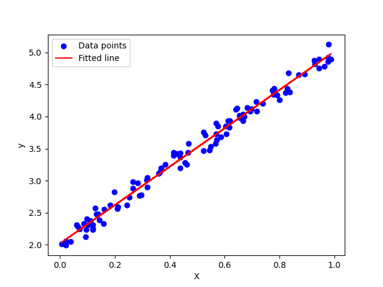

# mlearn.py
classic machine learning algorithm implementation with `clean` and `readable` code and `sklearn-like` api

## Install
```bash
cd mlearn.py && pip install -e . # [dev]
# or
cd mlearn.py && pip install .
# or
pip install git+https://github.com/gseismic/mlearn.py.git
```

## Feature 特性
- [x] sklearn-like api & `clean` and `readable` code
- [x] Both `Chinese`(中文) and `English` version comments
- [x] `linear_model.LinearRegression` 线性回归
- [x] `tree.DecisionTreeClassifier` 决策树分类
- [x] `tree.DecisionTreeRegressor` 决策树回归
- [x] `metrics.r2_score/accurency_score/..` 评价指标
- [x] `ensemble.random_forest.RandomForestClassifier`-naive-version 随机森林分类
- [x] `ensemble.random_forest.RandomForestRegressor`-naive-version 随机森林回归
- [x] `ensemble.gbdt.GBDTClassifier`-naive-version GBDT分类
- [x] `ensemble.gbdt.GBDTRegressor`-naive-version GBDT回归
- [ ] K nearest neighbors 最近邻
- [ ] naive_bayes 朴素贝叶斯算法
- [ ] max_entropy 最大熵算法
- [ ] svm 支持向量机
- [ ] mlp 多层感知机

## Examples 示例
```python
# examples/demo_linear_regression.py
import numpy as np
from mlearn import linear_model
import matplotlib.pyplot as plt

# get dataset | 获取数据集
np.random.seed(0)
X = np.random.rand(100, 1)  # shape: (100, 1)
y = 2 + 3 * X + np.random.randn(100, 1) * 0.1  # shape: (100, 1)

# create and train model | 创建并训练模型
model = linear_model.LinearRegression()
model.fit(X, y)  # X shape: (100, 1), y shape: (100, 1)
# print | 打印结果
print("Coefficients:", model.coef_)  # shape: (1,)
print("Intercept:", model.intercept_)  # shape: ()
print("**R² Score:", model.score(X, y))  # X shape: (100, 1), y shape: (100, 1)

# predict | 预测
X_test = np.array([[0.5]])  # shape: (1, 1)
print("Prediction for X=0.5:", model.predict(X_test))  # 输出 shape: (1,)

# plot | 绘图
plt.scatter(X, y, color='blue', label='Data points')
plt.plot(X, model.predict(X), color='red', label='Fitted line')
plt.xlabel('X')
plt.ylabel('y')
plt.legend()
plt.show()
```
output:


## Reference 参考资料
- [sklearn](https://scikit-learn.org/stable/modules/tree.html)
- [机器学习-周志华]
- [统计学习方法-李航]

## ChangeLog
- [@2024-08-30] project created
- [@2024-09-09] add ensemble.random_forest & test tree_regressor & tree_classifier
- [@2024-09-10] add ensemble.gbdt & test gbdt_classifier & gbdt_regressor & metric.log_loss 